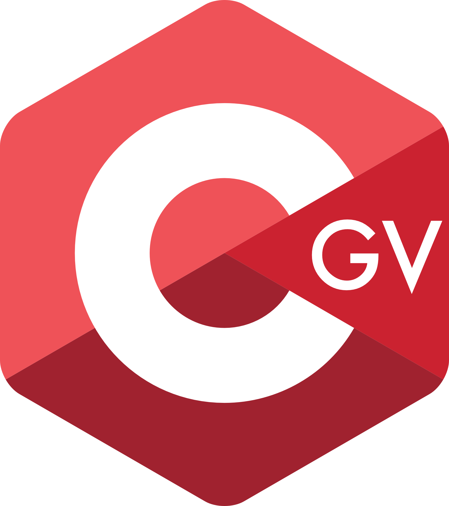

<!-- Profile README for @sigveer -->

<!-- Top Animated Banner -->

  

---

### Experience with:

  
  &nbsp;&nbsp;
  
  &nbsp;&nbsp;
  
  &nbsp;&nbsp;
  
   &nbsp;&nbsp;
  
  &nbsp;&nbsp;
  
  &nbsp;&nbsp;
  

---

### Featured Projects:
<b>TIHLDE IT-operations website</b> 
Live: <a href="https://drift.tihlde.org/">drift.tihlde.org</a> 
Repository: <a href="https://github.com/TIHLDE/drift">TIHLDE/drift</a>

  

